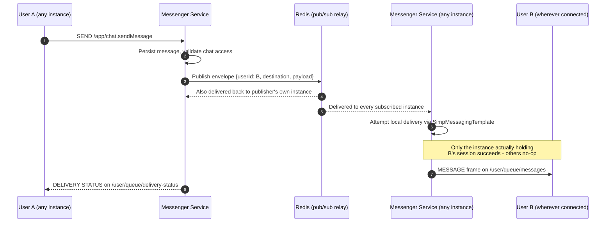
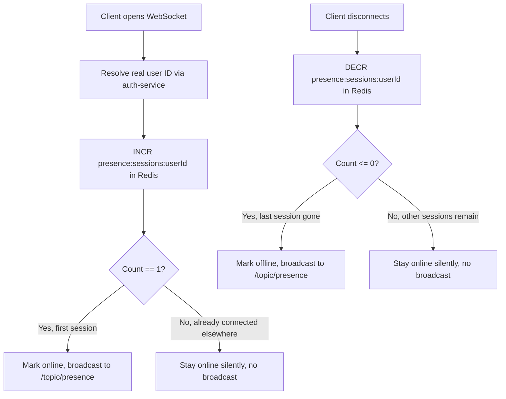

<p align="center">
  
</p>

<h1 align="center">Premisave Messenger Service: Real-Time Chat &amp; Presence API</h1>

<p align="center">
  <b>A production-minded Spring Boot 4 &amp; MongoDB microservice powering real-time 1:1 and group messaging for the Premisave platform — WebSocket/STOMP delivery, Redis-relayed for correct behavior across multiple instances, with live presence, typing, delivery, and read-receipt tracking.</b>
</p>

<p align="center">
  <a href="https://github.com/peacemakerbill">
    
  </a>
  <br/>
  <sub>Built by <a href="https://github.com/peacemakerbill"><b>Bill Graham Peacemaker</b></a> (<code>@peacemakerbill</code>) · Backend Developer &amp; API Support Engineer · Nairobi, Kenya</sub>
</p>

<p align="center">
  
  
  
  
  
  
  
  
</p>

<p align="center">
  <a href="https://github.com/peacemakerbill/premisave-messenger-service/stargazers"></a>
  <a href="https://github.com/peacemakerbill/premisave-messenger-service/network/members"></a>
  <a href="https://github.com/peacemakerbill/premisave-messenger-service/issues"></a>
  <a href="https://github.com/peacemakerbill/premisave-messenger-service/commits"></a>
  
  
  
</p>

<p align="center">
  <a href="#quick-start">Quick start</a> ·
  <a href="#architecture">Architecture</a> ·
  <a href="#how-real-time-delivery-works">Real-time delivery</a> ·
  <a href="#how-presence-tracking-works">Presence</a> ·
  <a href="#api-reference">API reference</a> ·
  <a href="#configuration-reference">Configuration</a> ·
  <a href="#troubleshooting">Troubleshooting</a>
</p>

> **If this saves you time building real-time chat with Spring and STOMP, please star the repo.** It helps other developers find a working, horizontally-scalable reference implementation.

> **Disclaimer.** This is an independent, community-built project shared as a portfolio and reference implementation. It is not affiliated with or endorsed by any third party mentioned here. Always follow your own provider's current documentation for production credentials and go-live requirements.

---

## Table of contents

1. [What is this?](#what-is-this)
2. [Features](#features)
3. [Architecture](#architecture)
4. [How real-time delivery works](#how-real-time-delivery-works)
5. [How presence tracking works](#how-presence-tracking-works)
6. [Quick start](#quick-start)
7. [Configuration reference](#configuration-reference)
8. [API reference](#api-reference)
9. [WebSocket destinations reference](#websocket-destinations-reference)
10. [Testing real-time messaging](#testing-real-time-messaging)
11. [Data model](#data-model)
12. [Scaling and production readiness](#scaling-and-production-readiness)
13. [Security notes](#security-notes)
14. [Project structure](#project-structure)
15. [Troubleshooting](#troubleshooting)
16. [Roadmap ideas](#roadmap-ideas)
17. [Contributing](#contributing)
18. [Author](#author)

---

## What is this?

**Premisave Messenger Service** is the real-time communication layer of the Premisave platform: a Java Spring Boot microservice that gives every user private 1:1 chats and groups, with the kind of live feedback people expect from modern messaging apps — delivered correctly, whether the app is running as one instance or many.

Real-time messaging looks simple until you actually run more than one instance behind a load balancer. A naive WebSocket setup silently drops messages the moment sender and recipient land on different server instances, because each instance's in-memory broker only knows about its own connections. This service is built around solving that specific problem from the start, rather than discovering it in production:

- every message, presence change, typing indicator, delivery confirmation, and read receipt is relayed through **Redis pub/sub**, so any instance can deliver to any connected user, regardless of which instance actually handled the request,
- presence (online/offline) is tracked with a **Redis-backed session counter per user**, so closing one of several open tabs or devices doesn't incorrectly show a user as offline,
- WebSocket identity is resolved to the user's **real account ID** (not the JWT's email subject) at connect time, and carried consistently through every downstream operation — message routing, presence keys, and enrichment calls all agree on the same identifier.

It was built as a sibling service to `auth-service` (which owns user identity and profiles) — this service owns chats, messages, groups, media, and presence, and calls out to `auth-service` for anything identity-related rather than duplicating user data.

## Features

| | |
|---|---|
| **Real-time 1:1 and group messaging** | STOMP over raw WebSocket (`/ws-messenger`), no SockJS — connects directly from any standard STOMP client. |
| **Horizontally scalable by design** | Redis pub/sub relay means running multiple instances behind a load balancer delivers correctly, not just "usually." |
| **Live presence with multi-device support** | Online/offline tracked via a Redis session counter — a user only shows offline once their *last* connected session disconnects. |
| **Last seen** | Persisted per user, surfaced automatically in chat list responses. |
| **Typing indicators** | Real-time, Redis-relayed, delivered to the specific recipient. |
| **Live delivery confirmation** | The sender gets a real-time push (`/queue/delivery-status`) confirming their own message was delivered — separate from the incoming-message queue. |
| **Live read receipts** | Pushed to the sender the moment a recipient marks a message read, including which chat it belongs to. |
| **Chat list enrichment** | `GET /api/chats` returns full profile objects (name, email, profile picture, online status, last seen) for both the other participant *and* the caller — no extra round trip needed. |
| **Self-chat prevention** | Explicit validation blocks creating a chat with yourself, with a clear structured error. |
| **New-vs-existing chat signaling** | `POST /api/chats/private` returns `201` with a "created" message for a new chat, `200` with an "already exists" message when reusing one — plus a `newlyCreated` boolean for programmatic checks. |
| **Self-healing chat data** | If a chat's participant data was ever stored inconsistently (e.g. from an earlier bug), it's detected and corrected automatically the next time that chat is accessed. |
| **Group chats** | Create, add/remove members (single or bulk), promote/demote admins, transfer ownership, group photo, leave group. |
| **Media uploads** | Images, video, and documents via Cloudinary, organized by type. |
| **Structured downstream error handling** | A dependency being unavailable (e.g. `auth-service` down) returns a clean `503` naming which service failed, in a structured `details` field — not a raw stack trace. |
| **Production observability** | Prometheus metrics, Kubernetes-style health/liveness/readiness/startup probes, structured logging. |
| **Redis-backed caching** | Chat access, user profiles, and group data cached with tuned per-purpose TTLs. |
| **JWT authentication** | Shared secret with `auth-service`; both REST and WebSocket (STOMP `CONNECT` header) are authenticated the same way. |

## Architecture

```
┌──────────────┐      JWT (Bearer)      ┌─────────────────────────┐
│   End User   │ ────HTTP + WS────────► │                         │
└──────────────┘                        │                         │      ┌──────────────┐
                                         │   Premisave Messenger  │ ───► │  Cloudinary  │
┌──────────────┐    Feign / JWT         │      Service             │      └──────────────┘
│ auth-service │ ◄────────────────────► │  (this repository)     │
└──────────────┘                        │                         │      ┌──────────────┐
                                         │  MongoDB  <───►  Redis  │ ───► │ auth-service │
                                         │                         │      │ (identity,   │
                                         └─────────────────────────┘      │  profiles)   │
                                                    │                     └──────────────┘
                                                    │  pub/sub relay
                                                    ▼
                                         (every messenger-service
                                          instance subscribes here)
```

**Design choices**

- **Identity lives in `auth-service`; this service only stores a real user ID and, where useful, a cached email/name.** No password or credential data is ever duplicated here.
- **The Redis relay is the delivery backbone, not an optimization.** Every cross-user push — messages, presence, typing, delivery status, read receipts — goes through it, so the service behaves identically whether you run one instance or ten.
- **WebSocket authentication resolves the real account ID once, at connect time**, via `auth-service`'s `/profile/me`, and carries both the ID and the original JWT together on the STOMP session's `Principal` for the life of that connection — downstream enrichment calls reuse the real token instead of fabricating one.

## How real-time delivery works



This same relay pattern covers typing indicators (`/queue/typing`), read receipts (`/queue/read-receipts`), and presence changes (`/topic/presence` — a topic-wide broadcast rather than a single-user push, using the same envelope with no target user).

## How presence tracking works



Because the session counter lives in Redis rather than in-instance memory, this is correct even when a user's two tabs, or two devices, happen to connect to different instances behind a load balancer.

## Quick start

### Prerequisites

- **Java 21**
- **Maven 3.9+**
- **MongoDB** running locally, in Docker, or on Atlas
- **Redis** running locally or hosted (used for caching, the WebSocket relay, and presence session counters)
- A running `auth-service` instance (this service depends on it for identity resolution — REST *and* WebSocket auth both call out to it)
- Cloudinary credentials, if you intend to test media upload

```bash
# 1. Clone
git clone https://github.com/peacemakerbill/premisave-messenger-service.git
cd premisave-messenger-service

# 2. Start MongoDB and Redis (skip if you already have them)
docker run -d --name messenger-mongo -p 27017:27017 mongo:8
docker run -d --name messenger-redis -p 6379:6379 redis:7

# 3. Create your .env (see the next section), then run
mvn spring-boot:run
```

Create a `.env` file next to `pom.xml`:

```properties
# Core
MONGODB_URI=mongodb://localhost:27017/premisave-messenger
REDIS_URL=redis://localhost:6379
JWT_SECRET=<the same long, random secret used by auth-service>

# Auth Service Integration (required - identity, profiles, WebSocket auth)
AUTH_SERVICE_URL=http://localhost:8080

# Actuator Basic Auth
ACTUATOR_USER=actuator
ACTUATOR_PASSWORD=<a secure password>

# Cloudinary (media uploads)
CLOUDINARY_CLOUD_NAME=...
CLOUDINARY_API_KEY=...
CLOUDINARY_API_SECRET=...
```

> **Important:** `JWT_SECRET` must be byte-identical to the one `auth-service` uses — tokens are verified with the same HMAC key across both services. If you see `JWT secret was truncated to 32 bytes` in the logs, that's expected: the key is padded or truncated to exactly 32 bytes before signing, deliberately, so both services derive the same effective key regardless of the raw secret's length.

When the service is healthy you'll see lines like:

```
Tomcat started on port 8081 (http) with context path '/'
WebSocket authenticated for user: <userId> (<email>)
Message <id> delivery completed. Success: 1/1, Failures: 0
```

## Configuration reference

| Variable | Required | Default | Purpose |
|---|:---:|---|---|
| `MONGODB_URI` | No | `mongodb://localhost:27017/premisave-messenger` | MongoDB connection string. **Note:** Spring Boot 4 uses `spring.mongodb.uri`, not the pre-4.0 `spring.data.mongodb.uri` — see [Troubleshooting](#troubleshooting) if migrating an older config. |
| `REDIS_URL` | No | `redis://localhost:6379` | Used for caching, the WebSocket relay channel, and presence session counters. |
| `JWT_SECRET` | Yes | — | Must match `auth-service` exactly. Base64-encoded; padded/truncated to 32 bytes for HMAC-SHA256. |
| `AUTH_SERVICE_URL` | No | `http://localhost:8080` | Feign client target for all identity/profile/social calls. |
| `ACTUATOR_USER` / `ACTUATOR_PASSWORD` | No | `actuator` / `actuator123` | Basic Auth for `/actuator/**` (health details, metrics, Prometheus scrape). |
| `CLOUDINARY_CLOUD_NAME` / `CLOUDINARY_API_KEY` / `CLOUDINARY_API_SECRET` | For media upload | — | Cloudinary credentials for `/api/media/upload`. |

## API reference

| Method | Endpoint | Purpose |
|---|---|---|
| `POST` | `/api/chats/private` | Create or fetch a private chat (`201` new / `200` existing) |
| `GET` | `/api/chats` | List the caller's chats, enriched with full profile + presence data |
| `DELETE` | `/api/chats/{chatId}` | Archive a chat |
| `GET` | `/api/messages/{chatId}` | Paginated message history for a chat |
| `DELETE` | `/api/messages/{messageId}` | Delete a message (for everyone or for self) |
| `POST` | `/api/groups` | Create a group |
| `POST` / `DELETE` | `/api/groups/{groupId}/members` | Add / remove a single member |
| `POST` / `DELETE` | `/api/groups/{groupId}/members/bulk` | Add / remove members in bulk |
| `POST` / `DELETE` | `/api/groups/{groupId}/admins` | Promote / demote a single admin |
| `POST` | `/api/groups/{groupId}/transfer-admin` | Transfer group ownership |
| `POST` | `/api/groups/{groupId}/leave` | Leave a group |
| `GET` | `/api/groups/my-groups` | List the caller's groups |
| `POST` | `/api/media/upload` | Upload an image, video, or document via Cloudinary |
| `GET` | `/health`, `/health/ready`, `/health/live`, `/health/startup` | Kubernetes-style health probes (unauthenticated) |
| `GET` | `/actuator/health`, `/actuator/metrics`, `/actuator/prometheus` | Actuator endpoints (Basic Auth) |

## WebSocket destinations reference

Connect with a STOMP client to `ws://<host>:8081/ws-messenger`, sending `Authorization: Bearer <jwt>` as a **native STOMP header on the CONNECT frame** (not a plain HTTP header — this is a raw WebSocket endpoint with no SockJS handshake).

| Direction | Destination | Purpose |
|---|---|---|
| Send | `/app/chat.sendMessage` | Send a message (`chatId`, `content`, `messageType`) |
| Send | `/app/chat.typing` | Notify the recipient you're typing |
| Send | `/app/chat.read` | Mark a message as read (`id`) |
| Subscribe | `/user/queue/messages` | Incoming messages from others |
| Subscribe | `/user/queue/delivery-status` | Live delivery confirmation for messages *you* sent |
| Subscribe | `/user/queue/read-receipts` | Live "seen" notifications for messages *you* sent |
| Subscribe | `/user/queue/typing` | Typing indicators from the other participant |
| Subscribe | `/topic/presence` | Online/offline broadcasts for any user |

## Testing real-time messaging

Since most HTTP tools (including Postman, at the time of writing) don't offer a native STOMP frame builder for raw WebSocket connections, this repo includes `websocket-test.html` — a small, dependency-free page that runs a real STOMP client in your browser. Open it locally, paste in two users' tokens and a `chatId`, and you can connect, subscribe, send, and mark-as-read from both sides at once, watching messages, delivery status, read receipts, and presence changes all update live.

## Data model

| Entity | Collection | Key fields |
|---|---|---|
| `Chat` | `chats` | `chatType` (PRIVATE/GROUP), `participantIds`, `participantEmails`, `lastMessageId` |
| `Message` | `messages` | `chatId`, `senderId`, `content`, `deliveryState`, `receipts`, `readBy`, `@Version` for optimistic locking |
| `Group` | `groups` | `name`, `adminId`, `memberIds`, `groupPhotoUrl` |
| `UserPresence` | `user_presence` | `userId`, `isOnline`, `lastSeen` |

## Scaling and production readiness

**Solved in this codebase:**

| Status | Item |
|---|---|
|  | Cross-instance real-time delivery (Redis pub/sub relay) |
|  | Multi-device presence correctness (Redis session counter) |
|  | Structured error handling for downstream failures |
|  | Observability (Prometheus metrics, health probes) |

**Known limitations, tracked honestly rather than glossed over:**

| Status | Item |
|---|---|
|  | MongoDB currently runs as a single standalone node in this configuration — no replica set, no automatic failover. |
|  | Message idempotency keys are currently generated server-side per call rather than accepted from the client, which means a genuinely retried send isn't deduplicated the way the field name implies. See [Roadmap](#roadmap-ideas). |
|  | Rate limiting is a simple in-memory fixed-window counter, not distributed — each instance enforces its own limit independently rather than a shared one. |
|  | The Redis relay fix has been verified against the message flow logically and via code review, but not yet load-tested with two real running instances side by side. |

## Security notes

- **JWT authentication** on both REST (via filter) and WebSocket (via `STOMP CONNECT` interceptor, resolving the real user ID — never trusting the JWT's email subject as an identifier).
- **Chat access validation** before any message operation — a user can only read or send within chats they're actually a participant of.
- **Self-chat prevention** and **input validation** on chat creation.
- **CORS** configured centrally; tighten `setAllowedOriginPatterns` before production deployment.
- **Stateless sessions** — no server-side session state beyond Redis-backed presence counters, fully horizontally scalable.

## Project structure

```
premisave-messenger-service/
├── src/main/java/com/premisave/messenger/
│   ├── config/          # Security, Mongo, Redis, WebSocket, Cache, Async
│   ├── client/           # Feign client for auth-service integration
│   ├── controller/       # REST + WebSocket (@MessageMapping) controllers
│   ├── service/          # Chat, Message, Group, Presence, Media, User services
│   ├── realtime/         # Redis pub/sub relay (publisher, subscriber, envelope)
│   ├── entity/            # MongoDB documents
│   ├── dto/               # Request/response DTOs
│   ├── security/          # JWT filter, WebSocket auth interceptor, WebSocketPrincipal
│   ├── event/              # WebSocket session lifecycle listeners
│   ├── exception/          # GlobalExceptionHandler, custom exceptions
│   └── PremisaveMessengerServiceApplication.java
├── src/main/resources/
│   └── application.yml
├── websocket-test.html   # Standalone browser-based STOMP test client
└── pom.xml
```

## Troubleshooting

<details>
<summary><b>MongoDB connects but data lands in a database literally named "test"</b></summary>

You're using the pre-4.0 property path. Spring Boot 4 moved MongoDB driver configuration from `spring.data.mongodb.uri` to `spring.mongodb.uri` (dropping the `data` segment). The old key silently binds to nothing, and the driver falls back to its own built-in default (`mongodb://localhost/test`) rather than failing loudly.
</details>

<details>
<summary><b>WebSocket handshake fails with a plain <code>400 Bad Request</code>, no STOMP-level detail</b></summary>

Check whether the endpoint is registered `.withSockJS()`. A raw STOMP client connecting directly to a SockJS-only endpoint gets rejected at the HTTP upgrade step, before any STOMP frame is even processed — the two protocols aren't interchangeable.
</details>

<details>
<summary><b>Jackson (de)serialization or <code>ObjectMapper</code> injection fails after upgrading to Spring Boot 4</b></summary>

Spring Boot 4 ships Jackson 3 (`tools.jackson.databind.*`) as the auto-configured default, not the classic Jackson 2 (`com.fasterxml.jackson.databind.*`). Any custom `ObjectMapper` field or bean must import from the new package, or Spring can't find a matching bean to autowire.
</details>

<details>
<summary><b>App fails to start with a Spring Cloud/Boot compatibility error</b></summary>

Spring Cloud release trains are pinned to specific Spring Boot minor versions. If you bump Spring Boot's minor version, check whether your `spring-cloud-dependencies` BOM version actually supports it — the compatibility verifier will name the exact supported range in its error message.
</details>

<details>
<summary><b>A WebSocket-delivered message shows the sender as "Unknown User"</b></summary>

Check that the real JWT — not a fabricated token — is what's being passed to the sender-enrichment call. A common mistake is reconstructing a fake `"Bearer " + userId` string somewhere in the delivery path instead of threading the real token all the way through.
</details>

## Roadmap ideas

Real, currently-known gaps and follow-ups, not commitments:

- [ ] Accept a client-supplied idempotency key for message sends, so a genuinely retried request is deduplicated (current server-generated-per-call key can never match a prior attempt)
- [ ] Load-test the Redis relay fix with two or more real running instances behind a load balancer
- [ ] Move rate limiting to a distributed, Redis-backed implementation shared across instances
- [ ] MongoDB replica set for durability and read scaling
- [ ] Circuit breaker / bulkhead pattern around the `auth-service` Feign calls, so a slow dependency degrades gracefully instead of tying up threads
- [ ] Reconsider whether `participantEmails` on `Chat` is worth keeping now that `auth-service`'s public profile endpoint includes email directly

## Contributing

This is a proprietary service for the Premisave platform. If you have been granted access to contribute:

1. Fork the repository and create a branch: `git checkout -b feature/my-improvement`
2. Make your change and keep the code style consistent.
3. Commit with a clear message and open a pull request describing what and why.

Found a bug or have a real-time messaging question? [Open an issue](https://github.com/peacemakerbill/premisave-messenger-service/issues).

## Author

<table>
  <tr>
    <td align="center" width="180">
      <a href="https://github.com/peacemakerbill">
        <br/>
        <sub><b>Bill Graham Peacemaker</b></sub>
      </a>
    </td>
    <td>
      <b>Backend Developer &amp; API Support Engineer at Safaricom PLC</b><br/>
      Nairobi, Kenya<br/><br/>
      Enterprise systems developer and API integration specialist, working across backend microservices (Java/Spring Boot), Flutter frontends, and DevOps.<br/><br/>
      <a href="https://github.com/peacemakerbill"></a>
      <a href="https://github.com/peacemakerbill?tab=followers"></a>
      <br/><br/>
      More from me: <a href="https://github.com/peacemakerbill/premisave-wallet-service">premisave-wallet-service</a> ·
      <a href="https://github.com/peacemakerbill/premisave-c2b-hakikisha-service-m-pesa">premisave-c2b-hakikisha-service-m-pesa</a> ·
      <a href="https://github.com/peacemakerbill/premisave_auth_service">premisave_auth_service</a> ·
      <a href="https://github.com/peacemakerbill/premisave_flutter_frontend">premisave_flutter_frontend</a> ·
      <a href="https://github.com/peacemakerbill?tab=repositories">all repositories</a>
    </td>
  </tr>
</table>

### Star history

<a href="https://star-history.com/#peacemakerbill/premisave-messenger-service&Date">
  
</a>

---

<details>
<summary>Search keywords</summary>

Spring Boot microservice · Java real-time chat backend · WebSocket STOMP Java · real-time messaging API · horizontally scalable WebSocket · Redis pub/sub WebSocket relay · multi-instance WebSocket delivery · presence tracking system · online offline status API · typing indicator implementation · read receipts API · delivery confirmation messaging · MongoDB Spring Boot microservice · Redis caching Spring Boot · JWT authentication Spring Security 7 · Spring Cloud OpenFeign · microservice architecture Java · group chat API Java · Cloudinary media upload Java · fintech chat backend Kenya · Premisave · Spring Boot 4 WebSocket · STOMP over WebSocket without SockJS

</details>

<p align="center">
  <sub>Made in Nairobi, Kenya · <a href="https://github.com/peacemakerbill">@peacemakerbill</a></sub>
</p>